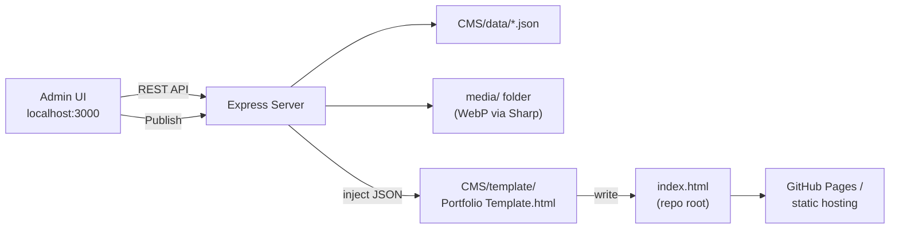

# Chris Moore Designs — Portfolio

This is the source for my personal portfolio website — a showcase of work spanning lighting design, art installations, electronics, apps, fabrication, and systems integration.

The live site (`[index.html](index.html)`) is a single, self-contained static page built with React 18 (UMD), Babel Standalone, and Tailwind CSS (all via CDN). It reads its content from a JSON block embedded directly in the page, so there's no build step and no backend required to host or view it — it can be served as-is from GitHub Pages or any static file host.

Projects are organized into six categories that map to folders under `[media/](media/)`:

- **Lighting**
- **Art**
- **Circuits** (Electronics)
- **Apps**
- **Solutions** (Fabrication)
- **Integration**

## Repository Structure

```
Portfolio/
├── index.html          # Published static site (generated — edit via the CMS, not by hand)
├── media/               # Project images/video, organized by category/project
├── CMS/                 # Local admin tool used to edit content & publish index.html
│   ├── server.js               # Express server (API + admin UI + preview)
│   ├── lib/
│   │   ├── data.js              # Project/settings CRUD, ordering & featured logic
│   │   ├── media.js             # Image upload processing (WebP conversion)
│   │   └── publish.js           # Injects data into the template to produce index.html
│   ├── public/index.html       # The admin UI itself
│   ├── template/
│   │   └── Portfolio Template.html   # Site template with a {{PORTFOLIO_DATA}} placeholder
│   ├── data/
│   │   ├── projects.json        # Source of truth for all portfolio projects
│   │   └── settings.json        # Site-wide settings (about, socials, contact form)
│   └── scripts/
│       └── migrate.js           # Re-extracts data from a published index.html
```

## How the CMS Works

The `CMS/` folder is a local, single-user content management tool built specifically for this site. It's a small Node.js/Express app that runs on your machine, lets you edit project content and media through a browser-based admin UI, and "publishes" by regenerating the static `index.html` at the repo root. There is no database and no server component on the live, deployed site — the CMS only exists locally, as an authoring tool.



### Getting Started

```bash
cd CMS
npm install
npm start
```

Then open `http://localhost:3000` in a browser. On Windows, `[CMS/launch.bat](CMS/launch.bat)` is a convenience script that frees up port 3000 if it's already in use, starts the server, and opens the admin UI automatically.

### Editing Content

The admin UI lets you manage, per project:

- Title, category, and tags
- Banner image (uploaded or linked by path/URL)
- Short and long descriptions, edited with a rich-text (Quill) editor
- A gallery of images and/or YouTube links, with drag-to-reorder and thumbnail previews
- Action links — website, launch app, GitHub, shop
- Downloadable files (name + URL pairs)
- **Featured** and **WIP** flags

It also has a "Main Interface" settings screen for site-wide configuration:

- About Me text and headshot
- Social links (email, Instagram, LinkedIn, GitHub)
- EmailJS credentials for the contact form (service ID, template ID, public key)

Projects can be reordered and moved between categories via drag-and-drop, and the UI tracks unsaved changes so you're warned before navigating away from edits in progress.

### Data Storage

All content lives in plain JSON files, not a database:

- `[CMS/data/projects.json](CMS/data/projects.json)` — every project and its metadata
- `[CMS/data/settings.json](CMS/data/settings.json)` — global site settings

`[CMS/lib/data.js](CMS/lib/data.js)` handles reading and writing this data, and enforces a few content rules automatically:

- Marking a project **Featured** clears the Featured flag on any other project in the same category, so only one project per category is ever featured.
- Each project has an `order` value scoped to its category, used to control display order; new projects and re-categorized projects have their order recalculated automatically.

### Media Pipeline

Image uploads are handled by `[CMS/lib/media.js](CMS/lib/media.js)` using the [Sharp](https://sharp.pixelplumbing.com/) library:

- Every uploaded image is converted to **WebP** (quality 85) for smaller file sizes.
- EXIF orientation is corrected automatically so photos don't appear rotated.
- Files are saved into `media/<Category>/<Project Name>/`, matching the folder structure the published site expects.

A **Convert Media** action in the admin UI batch-converts any leftover non-WebP images already in `media/`, moves the originals into an `archive/` folder, and automatically rewrites any references to those files in `projects.json` and `settings.json`.

### Publishing

Clicking **Publish Website** triggers `[CMS/lib/publish.js](CMS/lib/publish.js)`, which:

1. Reads the current `projects.json` and `settings.json`.
2. Loads `[CMS/template/Portfolio Template.html](CMS/template/Portfolio%20Template.html)`, the React-based site template.
3. Replaces the `{{PORTFOLIO_DATA}}` placeholder in the template with the current project/settings data as JSON.
4. Writes the result to `index.html` at the repository root.

Before publishing (or any time after), you can preview the currently-published site locally at `http://localhost:3000/preview`.

Because publishing fully regenerates `index.html`, **the root `index.html` should be treated as generated output** — content changes should always go through the CMS and a re-publish, not direct edits to the file, or they'll be lost the next time you publish.

### Migrating Existing Data

`[CMS/scripts/migrate.js](CMS/scripts/migrate.js)` can extract the embedded project/settings JSON out of an already-published `index.html` and write it back into `CMS/data/projects.json` and `CMS/data/settings.json`. This is useful for recovering data from a manually-edited `index.html`, or for importing from an earlier version of this project that stored content in Google Sheets instead of local JSON.

```bash
cd CMS
npm run migrate
```

### Deploying Changes

Once you're happy with the preview:

1. Commit the updated `index.html` and any new files under `media/`.
2. Push to your Git remote.
3. If using GitHub Pages (or a similar static host), the updated site goes live automatically.

## Tech Stack

**Admin tool (CMS)**

- Node.js, Express, Multer — local server and file uploads
- HTML, Tailwind CSS (CDN), Quill.js, Phosphor Icons — admin UI
- Sharp — image processing (WebP conversion, EXIF correction)
- Flat JSON files — data storage

**Published site**

- React 18 (UMD build)
- Babel Standalone (in-browser JSX)
- Tailwind CSS (CDN)
- EmailJS — serverless contact form
- Google Analytics 4

## Notes

- `CMS/.gitignore` excludes `node_modules/` and `CMS/.uploads/` (a temporary staging directory used during file uploads).
- The CMS is intended for local/single-user use only — it has no authentication and is not designed to be deployed publicly.
