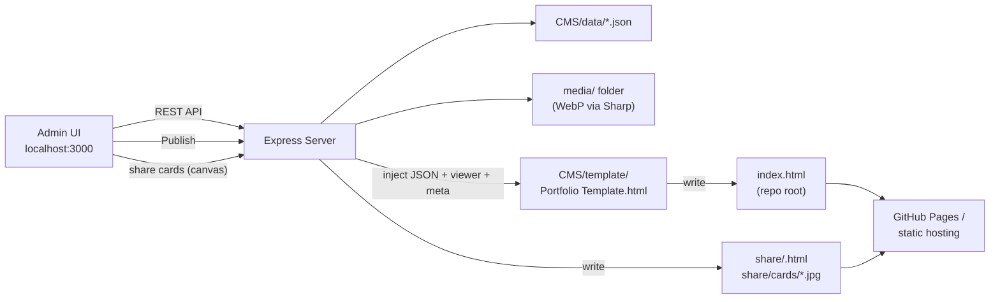

# Chris Moore Designs — Portfolio

This is the source for my personal portfolio website — a showcase of work spanning lighting design, art installations, electronics, apps, fabrication, and systems integration.

The local authoring tool is **CMS v2.5.2 Local**.

The live site (`[index.html](index.html)`) is a single, self-contained static page built with React 18 (UMD), Babel Standalone, and Tailwind CSS (all via CDN). It reads its content from a JSON block embedded directly in the page, so there's no build step and no backend required to host or view it — it can be served as-is from GitHub Pages or any static file host. Alongside it, the `[share/](share/)` folder holds small generated pages and preview images that give each project a proper social-media link preview.

Projects are organized into six categories that map to folders under `[media/](media/)`:

- **Lighting**
- **Art**
- **Fixtures**
- **Software**
- **Tooling**
- **Systems**

## Repository Structure

```
Portfolio/
├── CNAME                # Pins GitHub Pages to chrismoore.me
├── .nojekyll            # Stops Pages from skipping share/ or rewriting paths
├── index.html          # Published static site (generated — edit via the CMS, not by hand)
├── share/               # Generated social-sharing output (commit alongside index.html)
│   ├── <id>.html            # One Open Graph page per published project (crawler-safe; humans go to /#project/<id>)
│   └── cards/               # 1200x630 preview cards: <id>.jpg per project + site.jpg (hero board)
├── media/               # Project images/video/3D models, organized by category/project
│   └── <Category>/<Project>/
│       ├── *.webp, *.mp4        # Images (+ -thumb), videos (+ -poster)
│       ├── files/               # Downloadable attachments
│       └── models/              # 3D models: <name>.glb preview + poster (originals are never stored)
├── CMS/                 # Local admin tool used to edit content & publish index.html
│   ├── server.js               # Express server (API + admin UI + preview)
│   ├── lib/
│   │   ├── data.js              # Project/settings CRUD, ordering & featured logic
│   │   ├── gemini.js            # Server-side Gemini interview / short / long copy
│   │   ├── media.js             # Image / file / 3D model upload handling, relocation & trash
│   │   ├── video.js             # ffmpeg video transcoding + poster frames
│   │   ├── share.js             # Open Graph meta, share/<id>.html pages, share cards
│   │   └── publish.js           # Injects data + viewer core + meta into the template -> index.html
│   ├── prompts/
│   │   ├── writing-guide.md     # Shared system prompt (per-category interview and long banks)
│   │   └── sputnik.txt          # Voice sample (gitignored; never published)
│   ├── public/
│   │   ├── index.html           # The admin UI itself
│   │   └── js/
│   │       ├── model-viewer-core.js  # three.js GLB viewer shared by the CMS and the site
│   │       ├── model-tools.js        # STL / 3MF / STEP -> GLB conversion (browser-side)
│   │       ├── share-cards.js        # Canvas renderer for social preview cards
│   │       └── gemini-*.js           # Gemini settings + copy helpers
│   ├── template/
│   │   └── Portfolio Template.html   # Site template with {{PORTFOLIO_DATA}}, {{MODEL_VIEWER_CORE}}, {{SITE_META}}
│   ├── data/
│   │   ├── projects.json        # Source of truth for all portfolio projects
│   │   └── settings.json        # Site-wide settings (about, socials, contact form, sharing)
│   └── scripts/
│       └── migrate.js           # Re-extracts data from a published index.html
```

## How the CMS Works

The `CMS/` folder is a local, single-user content management tool built specifically for this site. It's a small Node.js/Express app that runs on your machine, lets you edit project content and media through a browser-based admin UI, and "publishes" by regenerating the static `index.html` at the repo root. There is no database and no server component on the live, deployed site — the CMS only exists locally, as an authoring tool.



### Getting Started

```bash
cd CMS
npm install
npm start
```

Then open `http://localhost:3000` in a browser. On Windows, `[CMS/launch.bat](CMS/launch.bat)` is a convenience script that frees up port 3000 if it's already in use, starts the server, and opens the admin UI automatically.

### Editing Content

The admin UI lets you manage, per project:

- Title, category, and tags
- Banner image (uploaded or linked by path/URL), with a crop tool for the card thumbnail and page banner that overlays an alignment grid (rule of thirds or golden ratio, toggleable)
- Short and long descriptions, edited with a rich-text (Quill) editor. Sparkle buttons on those toolbars can generate copy through Gemini (API key in Settings; writing prompts stay on the server and are never published). Interview questions and long-copy shape are steered by the project's category (Lighting, Art, Fixtures, Software, Tooling, Systems; Sculpture follows Art)
- A gallery of images, self-hosted videos, YouTube links and **3D models**, with drag-to-reorder and thumbnail previews
- A **3D model editor** per model: live preview, per-part color and opacity (slider, exact number field, or mouse wheel over either), up-axis (Z-up / Y-up), and "capture thumbnail from this view"
- Action links — website, launch app, GitHub, shop
- Downloadable files (name, URL, optional description, license, and toast thumbnail with WebP upload + 16:9 crop)
- **Featured** and **WIP** flags

It also has a "Main Interface" settings screen for site-wide configuration:

- About Me text and headshot
- Social links (email, Instagram, LinkedIn, GitHub)
- Sharing & social previews — public site URL (`https://chrismoore.me`), site title and one-line description used for Open Graph / Twitter cards
- EmailJS credentials for the contact form (service ID, template ID, public key)

Projects can be reordered and moved between categories via drag-and-drop, and the UI tracks unsaved changes so you're warned before navigating away from edits in progress.

### Data Storage

All content lives in plain JSON files, not a database:

- `[CMS/data/projects.json](CMS/data/projects.json)` — every project and its metadata
- `[CMS/data/settings.json](CMS/data/settings.json)` — global site settings

`[CMS/lib/data.js](CMS/lib/data.js)` handles reading and writing this data, and enforces a few content rules automatically:

- Marking a project **Featured** clears the Featured flag on any other project in the same category, so only one project per category is ever featured.
- Each project has an `order` value scoped to its category, used to control display order; new projects and re-categorized projects have their order recalculated automatically.

### Media Pipeline

Image uploads are handled by `[CMS/lib/media.js](CMS/lib/media.js)` using the [Sharp](https://sharp.pixelplumbing.com/) library:

- Every uploaded image is converted to **WebP** (quality 85) for smaller file sizes.
- EXIF orientation is corrected automatically so photos don't appear rotated.
- Files are saved into `media/<Category>/<Project Name>/`, matching the folder structure the published site expects.

A **Convert Media** action in the admin UI batch-converts any leftover non-WebP images already in `media/`, moves the originals into an `archive/` folder, and automatically rewrites any references to those files in `projects.json` and `settings.json`.

Videos go through `[CMS/lib/video.js](CMS/lib/video.js)` (ffmpeg): H.264 MP4 capped at 1080p/30fps, audio stripped unless requested, plus a WebP poster frame and thumbnail.

#### 3D models (STL, 3MF, STEP)

Gallery rows can also hold 3D models. Pick **3D Model** in the gallery toolbar and choose `.stl`, `.3mf`, `.step` or `.stp` files:

1. The file is converted **in the admin browser** by `[CMS/public/js/model-tools.js](CMS/public/js/model-tools.js)` — STL and 3MF via three.js loaders, STEP via OpenCascade compiled to WebAssembly (`occt-import-js`, served from `node_modules` at `/vendor/occt`). Everything is exported as a single **GLB**.
2. Only the GLB is uploaded (`POST /api/media/upload-model`) into `media/<Category>/<Project>/models/`. It is a reduced-poly preview for the website: the original STL/3MF/STEP never leaves your machine, is not committed to the repo, and the viewer offers no download. Printable files still go through the project's **Downloadable files** section if you want to share them.
3. A default thumbnail is captured automatically, then the **3D editor** opens: each part (body/object in the source file) gets a color picker and an opacity control — drag the slider, type an exact percentage, or hover either and use the mouse wheel (Shift for 5% steps) — so the preview can match the real object (e.g. a translucent diffuser). You can also switch the up axis and re-capture the thumbnail from any angle; the crop tool always shows the latest capture.

The gallery item stores everything the site needs:

```json
{
  "type": "model",
  "url": "media/Art/Pyramid/models/pyramid.glb",
  "format": "3mf",
  "up": "z",
  "parts": [
    { "name": "Body", "color": "#c0c0c0", "opacity": 1 },
    { "name": "Diffuser", "color": "#ffffff", "opacity": 0.35 }
  ],
  "poster": "media/Art/Pyramid/models/pyramid-poster.webp",
  "thumbnail": "media/Art/Pyramid/models/pyramid-poster-thumb.webp"
}
```

On the live site, models open in the lightbox in a three.js viewer (`[CMS/public/js/model-viewer-core.js](CMS/public/js/model-viewer-core.js)`, inlined into `index.html` at publish time). The model's bounding-box center is placed at the origin, and navigation follows CAD conventions — drag to orbit, right-drag or two-finger drag to pan, wheel or pinch to zoom — with mouse, touch and stylus all handled through pointer events. After a pan, orbit and zoom stay locked to that model-center pivot (the camera trucks; the target does not drift). three.js is loaded from a CDN import map only when a model is actually opened, so pages without models pay nothing.

### Publishing

Clicking **Publish Website** first renders the social preview cards in the browser (`[CMS/public/js/share-cards.js](CMS/public/js/share-cards.js)`, uploaded via `POST /api/share-cards`), then triggers `[CMS/lib/publish.js](CMS/lib/publish.js)`, which:

1. Reads the current `projects.json` and `settings.json` (drafts are excluded).
2. Loads `[CMS/template/Portfolio Template.html](CMS/template/Portfolio%20Template.html)`, the React-based site template.
3. Replaces `{{PORTFOLIO_DATA}}` with the project/settings JSON, `{{MODEL_VIEWER_CORE}}` with the 3D viewer source, and `{{SITE_META}}` with the site-wide Open Graph / Twitter tags.
4. Writes the result to `index.html` at the repository root.
5. Writes one `share/<id>.html` page per published project (via `[CMS/lib/share.js](CMS/lib/share.js)`) and removes pages/cards for projects that are no longer published.

Before publishing (or any time after), you can preview the currently-published site locally at `http://localhost:3000/preview`.

Because publishing fully regenerates `index.html` and `share/`, **both should be treated as generated output** — content changes should always go through the CMS and a re-publish, not direct edits to the files, or they'll be lost the next time you publish.

### Social sharing (Open Graph)

The site is a single page with hash routing (`#project/<id>`), and social crawlers ignore URL fragments, so a hash link alone would always show the generic site preview. Publishing therefore produces:

- `share/cards/<id>.jpg` — a 1200x630 card per project: the project thumbnail with the title, short description, category, and `chrismoore.me` on it.
- `share/cards/site.jpg` — a site card built from the hero board (the featured thumbnail from each of the six categories).
- `share/<id>.html` — a tiny page per project carrying `og:*` and `twitter:*` tags pointing at that card. Crawlers stay on this HTML so they can read the tags. Humans get a short delay, then are sent to `/#project/<id>` (known social-bot user agents skip the redirect entirely). There is no instant meta-refresh.

The **Share** button on a project (and the copy-link buttons in the CMS project list) hands out `https://chrismoore.me/share/<id>`, which is what should be pasted into Facebook, LinkedIn, X, iMessage, etc. `index.html` itself carries the site-wide tags, so sharing the bare domain also gets a rich preview. The public URL, title and description live in Settings.

Share links and card images only work on `chrismoore.me` once that domain is answered by GitHub Pages (see **Custom domain** below). While Squarespace still owns the domain, every path — including `/share/<id>` and `/share/cards/<id>.jpg` — 301s to the GitHub Pages homepage, and Facebook/LinkedIn scrape the generic site tags with no project image.

### Migrating Existing Data

`[CMS/scripts/migrate.js](CMS/scripts/migrate.js)` can extract the embedded project/settings JSON out of an already-published `index.html` and write it back into `CMS/data/projects.json` and `CMS/data/settings.json`. This is useful for recovering data from a manually-edited `index.html`, or for importing from an earlier version of this project that stored content in Google Sheets instead of local JSON.

```bash
cd CMS
npm run migrate
```

### Deploying Changes

Once you're happy with the preview:

1. Commit the updated `index.html`, the `share/` folder, `CNAME`, `.nojekyll`, and any new files under `media/`.
2. Push to your Git remote.
3. GitHub Pages serves the site. After the custom-domain cutover below, that is `https://chrismoore.me` (a project site under a custom domain is mounted at the domain root, so `/share/670` maps to `share/670.html`).

### Custom domain (chrismoore.me)

`site_url` in Settings is already `https://chrismoore.me`. A repo-root `CNAME` file pins GitHub Pages to that host. Squarespace must **stop answering** the domain or every path will keep 301ing to the homepage and social previews will stay broken.

One-time cutover:

1. Push a commit that includes `CNAME` and `.nojekyll`.
2. Repo **Settings → Pages**: set Custom domain to `chrismoore.me`, check **Enforce HTTPS**, and wait for the TLS certificate.
3. At the registrar, **remove** Squarespace A / CNAME / forwarding records. For the apex domain add GitHub's A records (`185.199.108.153`, `185.199.109.153`, `185.199.110.153`, `185.199.111.153`) and the IPv6 AAAA set from [GitHub's custom-domain docs](https://docs.github.com/en/pages/configuring-a-custom-domain-for-your-github-pages-site/managing-a-custom-domain-for-your-github-pages-site). Optional: `www` CNAME → `elusid108.github.io`.
4. After DNS and HTTPS are green, re-scrape `https://chrismoore.me/share/670` in the [Facebook Sharing Debugger](https://developers.facebook.com/tools/debug/) and [LinkedIn Post Inspector](https://www.linkedin.com/post-inspector/). Until then, `chrismoore.me/share/...` will still 301 to the homepage.

A working check after the flip: `https://chrismoore.me/share/670` should be `200` from GitHub (not a Squarespace 301), and `https://chrismoore.me/share/cards/670.jpg` should be `image/jpeg`.

## Tech Stack

**Admin tool (CMS)**

- Node.js, Express, Multer — local server and file uploads
- HTML, Tailwind CSS (CDN), Quill.js, Phosphor Icons — admin UI
- Sharp — image processing (WebP conversion, EXIF correction, share-card JPEGs)
- ffmpeg (`fluent-ffmpeg` + static binaries) — video transcoding
- three.js (CDN import map) + `occt-import-js` (OpenCascade WASM) — STL / 3MF / STEP to GLB conversion and 3D preview
- HTML Canvas — social preview card rendering
- Flat JSON files — data storage

**Published site**

- React 18 (UMD build)
- Babel Standalone (in-browser JSX)
- Tailwind CSS (CDN)
- three.js (CDN import map, loaded on demand) — 3D model viewer
- EmailJS — serverless contact form
- Google Analytics 4

## Notes

- `CMS/.gitignore` excludes `node_modules/` and `CMS/.uploads/` (a temporary staging directory used during file uploads).
- The CMS is intended for local/single-user use only — it has no authentication and is not designed to be deployed publicly.
